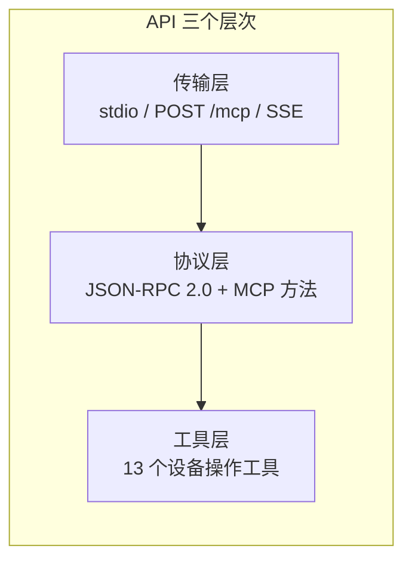
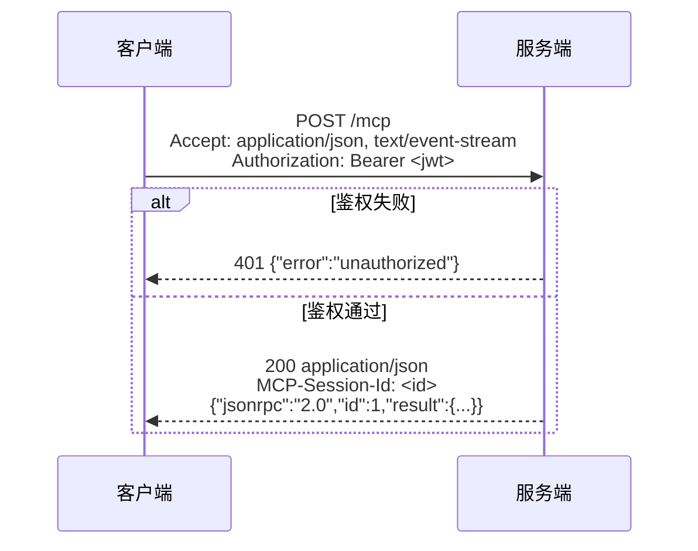
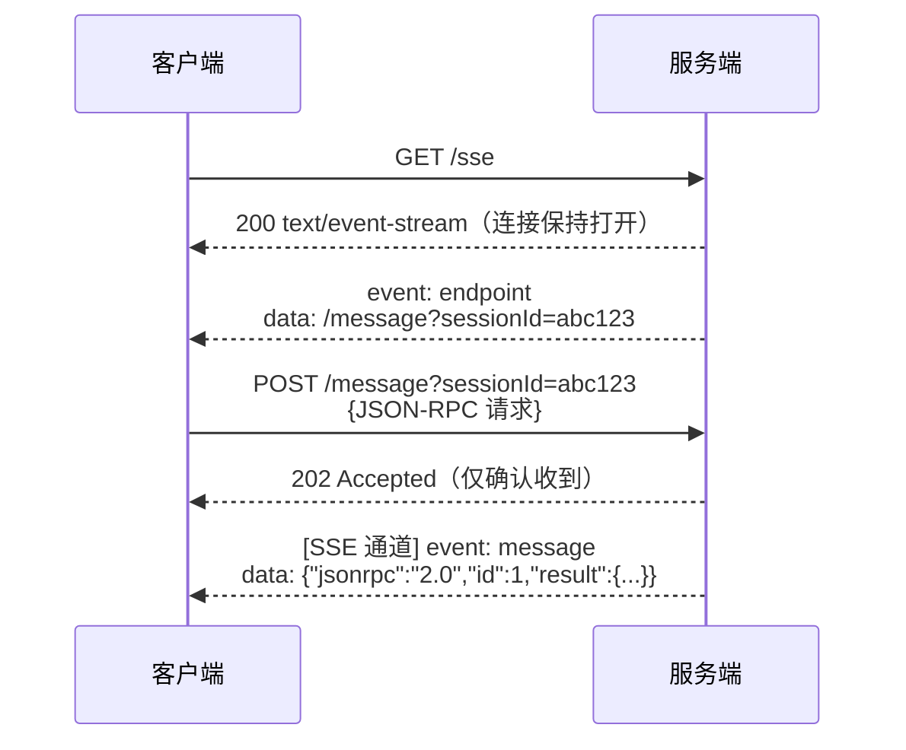
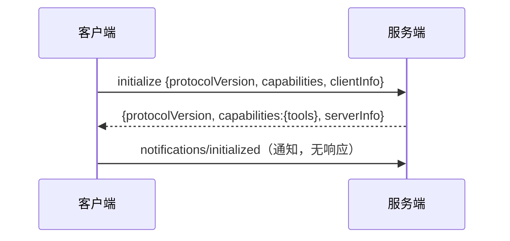
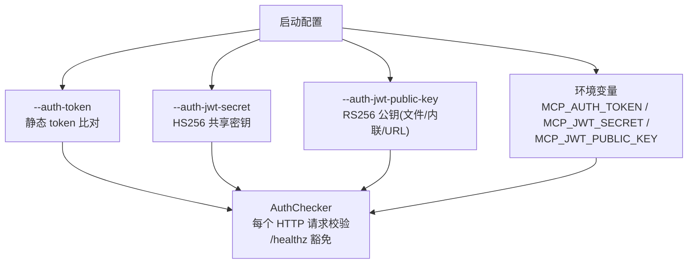
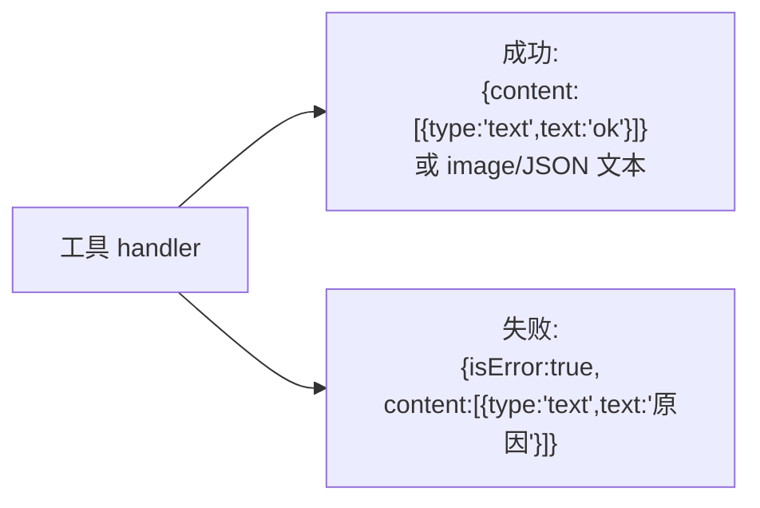
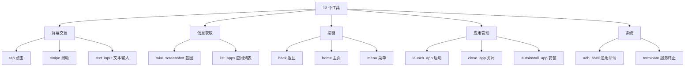
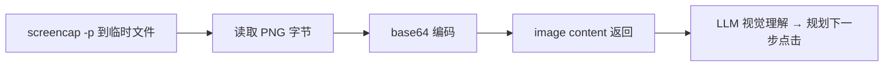
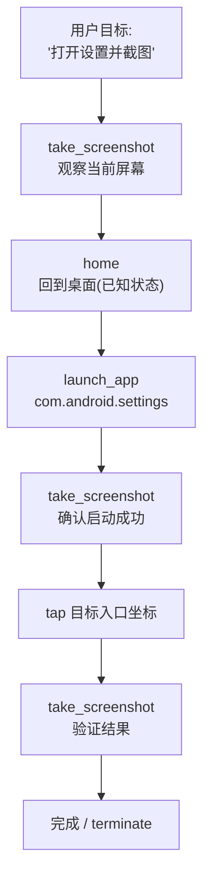

# mcp_mobile_use API 设计

> 本文档是 mcp_mobile_use 的完整 API 参考：传输端点、JSON-RPC 协议、鉴权规范、
> 13 个工具的全部参数/返回/错误/示例。
>
> 作者：hubin　　更新日期：2026-08-05

---

## 目录

1. [API 总览](#1-api-总览)
2. [传输端点规范](#2-传输端点规范)
3. [JSON-RPC 2.0 协议规范](#3-json-rpc-20-协议规范)
4. [MCP 方法](#4-mcp-方法)
5. [鉴权规范](#5-鉴权规范)
6. [工具通用约定](#6-工具通用约定)
7. [工具详细参考（13 个）](#7-工具详细参考13-个)
8. [错误处理全景](#8-错误处理全景)
9. [完整调用示例](#9-完整调用示例)

---

## 1. API 总览



| 层次 | 内容 | 说明 |
|---|---|---|
| 传输 | stdio、Streamable HTTP、SSE | 三种等价的 JSON-RPC 承载方式 |
| 协议 | `initialize` `ping` `tools/list` `tools/call` | MCP 标准方法 |
| 工具 | tap / swipe / take_screenshot / text_input / back / home / menu / launch_app / close_app / list_apps / autoinstall_app / adb_shell / terminate | 13 个 |

---

## 2. 传输端点规范

### 2.1 端点总表

| 端点 | 方法 | Content-Type | 说明 | 鉴权 |
|---|---|---|---|---|
| `/healthz` | GET | text/plain | 存活探针，固定返回 `ok` | 豁免 |
| `/mcp` | POST | application/json | Streamable HTTP 主端点 | 必需（开启时） |
| `/sse` | GET | text/event-stream | SSE 长连接建立 | 必需 |
| `/message?sessionId=` | POST | application/json | SSE 会话消息投递 | 必需 |
| stdio | — | — | 每行一个 JSON 文档 | 无（进程隔离） |

### 2.2 Streamable HTTP（POST /mcp）请求流程



**请求头规范：**

| 头 | 必需 | 说明 |
|---|---|---|
| `Content-Type: application/json` | 是 | 请求体为单个 JSON-RPC 消息 |
| `Accept: application/json, text/event-stream` | 是 | MCP 规范要求双格式声明 |
| `Authorization` | 开启鉴权时 | `Bearer <jwt>` 或静态 token |
| `MCP-Session-Id` | initialize 之后 | 服务端在 initialize 响应中下发 |

### 2.3 SSE 传输流程



**SSE 事件类型：**

| event | data | 时机 |
|---|---|---|
| `endpoint` | `/message?sessionId=<id>` | 连接建立后第一个事件 |
| `message` | JSON-RPC 响应文本 | 每个 POST /message 处理后 |

---

## 3. JSON-RPC 2.0 协议规范

### 3.1 消息信封

**请求：**

```json
{
  "jsonrpc": "2.0",
  "id": 1,
  "method": "tools/call",
  "params": { "name": "tap", "arguments": { "x": 540, "y": 1200 } }
}
```

**成功响应：**

```json
{
  "jsonrpc": "2.0",
  "id": 1,
  "result": { "content": [ { "type": "text", "text": "ok" } ] }
}
```

**协议错误响应：**

```json
{
  "jsonrpc": "2.0",
  "id": 1,
  "error": { "code": -32601, "message": "method not found: foo/bar" }
}
```

**业务错误响应（工具执行失败）：**

```json
{
  "jsonrpc": "2.0",
  "id": 1,
  "result": {
    "isError": true,
    "content": [ { "type": "text", "text": "package_name is required and must be a non-empty string" } ]
  }
}
```

### 3.2 错误码表

| code | 名称 | 触发条件 | 示例 message |
|---|---|---|---|
| -32700 | parse error | 请求体不是合法 JSON | `parse error: JSON parse error at offset 12: ...` |
| -32600 | invalid request | 非 JSON 对象 / 缺 `method` | `invalid request: missing method` |
| -32601 | method not found | method 未注册 | `method not found: foo` |
| -32603 | internal error | handler 内部异常（兜底） | `internal error: ...` |
| — | 业务错误 | 工具执行失败 | 走 `result.isError=true`，不占错误码 |

### 3.3 通知（Notification）

无 `id` 字段或 method 以 `notifications/` 开头的消息为通知，服务端处理但
**不产生任何响应**（stdio 不输出、HTTP 返回 202/空 body）。

---

## 4. MCP 方法

### 4.1 initialize

协商协议版本、获取服务能力与服务信息。



**请求：**

```json
{
  "jsonrpc": "2.0", "id": 1, "method": "initialize",
  "params": {
    "protocolVersion": "2024-11-05",
    "capabilities": {},
    "clientInfo": { "name": "my-agent", "version": "1.0" }
  }
}
```

**响应：**

```json
{
  "jsonrpc": "2.0", "id": 1,
  "result": {
    "protocolVersion": "2024-11-05",
    "capabilities": { "tools": {} },
    "serverInfo": { "name": "mcp_mobile_use", "version": "..." }
  }
}
```

### 4.2 ping

存活探测，返回空 result：

```json
{ "jsonrpc": "2.0", "id": 2, "method": "ping" }
→ { "jsonrpc": "2.0", "id": 2, "result": {} }
```

### 4.3 tools/list

返回全部 13 个工具的定义（名称、描述、inputSchema），按注册顺序：

```json
{ "jsonrpc": "2.0", "id": 3, "method": "tools/list" }
```

**响应结构（截断示意）：**

```json
{
  "jsonrpc": "2.0", "id": 3,
  "result": {
    "tools": [
      {
        "name": "tap",
        "description": "Tap the screen at the given coordinates",
        "inputSchema": {
          "type": "object",
          "properties": {
            "x": { "type": "number", "description": "The x coordinate of the tap point" },
            "y": { "type": "number", "description": "The y coordinate of the tap point" },
            "backend": { "type": "string", "enum": ["adb", "cloud"], "description": "..." }
          },
          "required": ["x", "y"]
        }
      }
    ]
  }
}
```

### 4.4 tools/call

调用指定工具：

```json
{
  "jsonrpc": "2.0", "id": 4, "method": "tools/call",
  "params": {
    "name": "tap",
    "arguments": { "x": 540, "y": 1200 }
  }
}
```

**result.content 内容类型：**

| type | 字段 | 用途 |
|---|---|---|
| `text` | `text` | 文本结果（"ok"、JSON 文本、错误描述） |
| `image` | `data` `mimeType` | 截图（base64 PNG） |

---

## 5. 鉴权规范

### 5.1 三种模式



| 模式 | 请求头格式 | 配置 |
|---|---|---|
| None | 不需要 | 默认 |
| Token | `Authorization: <token>` 或 `Authorization: Bearer <token>` | `--auth-token` / `MCP_AUTH_TOKEN` |
| JWT-HS256 | `Authorization: Bearer <jwt>` | `--auth-jwt-secret` / `MCP_JWT_SECRET` |
| JWT-RS256 | `Authorization: Bearer <jwt>` | `--auth-jwt-public-key` / `MCP_JWT_PUBLIC_KEY` |

### 5.2 RS256 公钥来源（--auth-jwt-public-key）

| 来源形式 | 示例 | 识别方式 |
|---|---|---|
| 本地 PEM 文件 | `/data/local/tmp/public.pem` | 读文件后含 `-----BEGIN` |
| 内联 PEM 字符串 | `-----BEGIN PUBLIC KEY-----\nMIIB...` | 直接含 `-----BEGIN` |
| JWKS URL | `http://gateway/api/auth/jwks` | `http(s)://` 前缀，拉取后按内容自动识别 PEM/JWKS |

**JWKS 选择规则**：取 `keys` 中第一个 `kty="RSA"` 且（`alg` 为空或 `alg="RS256"`）
的 key，提取 `n`（模数）、`e`（指数）做验签。

### 5.3 JWT claims 校验

| claim | 校验 | 说明 |
|---|---|---|
| `exp` | 必须 ≥ 当前时间 | 过期拒绝（`jwt expired`） |
| `nbf` | 必须 ≤ 当前时间 | 未生效拒绝 |
| `alg` | 必须匹配已配置算法 | 防算法降级攻击 |
| `sub/uid/...` | 不校验 | 业务声明透传 |

### 5.4 鉴权失败响应

```http
HTTP/1.1 401 Unauthorized
Content-Type: application/json

{"error":"unauthorized"}
```

---

## 6. 工具通用约定

### 6.1 backend 参数（所有工具共有）

每个工具的 inputSchema 都自动注入 `backend` 属性：

| 值 | 含义 | 执行路径 |
|---|---|---|
| `adb`（默认） | 设备本机执行 shell 命令 | LocalExecutor → fork → `sh -c` |
| `cloud` | 经华为云 CPH API 下发到目标云手机 | CloudExecutor → sync-commands |

### 6.2 返回结构



### 6.3 通用错误情形

| 情形 | isError 文本示例 |
|---|---|
| 必填参数缺失 | `x is required and must be a number` |
| 参数类型错误 | `command is required and must be a non-empty string` |
| 取值非法 | `download_url is invalid: ...` |
| 命令执行失败 | 底层 stderr 内容 |

---

## 7. 工具详细参考（13 个）

### 7.1 工具总览矩阵



| 工具 | 必填参数 | 可选参数 | 底层 shell |
|---|---|---|---|
| tap | x, y | — | `input tap x y` |
| swipe | from_x, from_y, to_x, to_y | duration_ms | `input swipe ...` |
| take_screenshot | — | — | `screencap -p` |
| text_input | text | — | `input text` |
| back / home / menu | — | — | `input keyevent 4/3/82` |
| launch_app | package_name | — | `monkey`/`am start` |
| close_app | package_name | — | `am force-stop` |
| list_apps | — | include_system | `pm list packages` |
| autoinstall_app | download_url | — | 下载 + `pm install` |
| adb_shell | command | timeout_ms | 任意 |
| terminate | — | — | 停止服务自身 |

---

### 7.2 tap — 点击屏幕坐标

**描述**：在指定坐标点击屏幕。

**参数：**

| 参数 | 类型 | 必填 | 说明 |
|---|---|---|---|
| `x` | number | 是 | 点击点 x 坐标（像素，设备坐标系） |
| `y` | number | 是 | 点击点 y 坐标（像素） |
| `backend` | string | 否 | `adb`（默认）/ `cloud` |

**请求示例：**

```json
{ "jsonrpc": "2.0", "id": 10, "method": "tools/call",
  "params": { "name": "tap", "arguments": { "x": 540, "y": 1200 } } }
```

**成功响应：**

```json
{ "jsonrpc": "2.0", "id": 10,
  "result": { "content": [ { "type": "text", "text": "ok" } ] } }
```

**失败响应（缺参数）：**

```json
{ "result": { "isError": true,
  "content": [ { "type": "text", "text": "x is required and must be a number" } ] } }
```

**底层命令**：`input tap 540 1200`

**注意事项**：坐标原点为屏幕左上角；分辨率可用 `adb_shell` 执行
`wm size` 查询。

---

### 7.3 swipe — 滑动

**描述**：从起点滑动到终点，可指定时长。

**参数：**

| 参数 | 类型 | 必填 | 默认 | 说明 |
|---|---|---|---|---|
| `from_x` | number | 是 | — | 起点 x |
| `from_y` | number | 是 | — | 起点 y |
| `to_x` | number | 是 | — | 终点 x |
| `to_y` | number | 是 | — | 终点 y |
| `duration_ms` | number | 否 | 300 | 滑动时长（毫秒） |

**请求示例：**

```json
{ "params": { "name": "swipe",
  "arguments": { "from_x": 540, "from_y": 1800, "to_x": 540, "to_y": 600, "duration_ms": 500 } } }
```

**底层命令**：`input swipe 540 1800 540 600 500`

**典型用法**：上滑翻页 `from_y=1800 → to_y=600`；下拉刷新反之。

---

### 7.4 take_screenshot — 截图

**描述**：截取设备当前屏幕，返回 PNG 图片内容。

**参数**：无（仅通用 `backend`）。

**请求示例：**

```json
{ "params": { "name": "take_screenshot", "arguments": {} } }
```

**成功响应：**

```json
{ "result": { "content": [
  { "type": "image", "data": "iVBORw0KGgoAAAANS...", "mimeType": "image/png" }
] } }
```



**注意事项**：
- cloud 后端受 CPH API 输出大小限制，大图可能被截断（工具描述中有提示）；
- 临时文件写在设备 `/data/local/tmp/`。

---

### 7.5 text_input — 文本输入

**描述**：向当前焦点输入框输入文本。

**参数：**

| 参数 | 类型 | 必填 | 说明 |
|---|---|---|---|
| `text` | string | 是 | 要输入的文本（自动 shell 转义） |

**请求示例：**

```json
{ "params": { "name": "text_input", "arguments": { "text": "hello world" } } }
```

**底层命令**：`input text 'hello world'`

**注意事项**：`input text` 对中文/emoji 支持取决于设备 IME；特殊字符
（空格、引号、`&`）由实现统一转义。复杂中文输入建议用 `adb_shell` 配合
剪贴板或广播方案。

---

### 7.6 back / home / menu — 按键事件

**描述**：发送 Android 按键事件。三工具同构，仅 keycode 不同。

| 工具 | keycode | 底层命令 |
|---|---|---|
| `back` | 4 | `input keyevent 4` |
| `home` | 3 | `input keyevent 3` |
| `menu` | 82 | `input keyevent 82` |

**参数**：无（仅通用 `backend`）。

**请求示例：**

```json
{ "params": { "name": "back", "arguments": {} } }
→ { "result": { "content": [ { "type": "text", "text": "ok" } ] } }
```

**典型用法**：`home` 回到桌面后 `launch_app` 启动目标应用，构成
"回到已知状态"的 Agent 操作原语。

---

### 7.7 launch_app — 启动应用

**描述**：按包名启动应用。

**参数：**

| 参数 | 类型 | 必填 | 说明 |
|---|---|---|---|
| `package_name` | string | 是 | 应用包名，如 `com.tencent.mm` |

**请求示例：**

```json
{ "params": { "name": "launch_app", "arguments": { "package_name": "com.android.settings" } } }
```

**底层命令**：monkey 启动（`monkey -p <pkg> -c android.intent.category.LAUNCHER 1`）
或 `am start` 回退。

**失败情形**：包名不存在 → `isError` 返回 monkey/am 的错误输出。

---

### 7.8 close_app — 关闭应用

**描述**：强制停止指定包名的应用。

**参数：**

| 参数 | 类型 | 必填 | 说明 |
|---|---|---|---|
| `package_name` | string | 是 | 应用包名 |

**底层命令**：`am force-stop <pkg>`

---

### 7.9 list_apps — 应用列表

**描述**：列出设备已安装应用，默认仅第三方应用。

**参数：**

| 参数 | 类型 | 必填 | 默认 | 说明 |
|---|---|---|---|---|
| `include_system` | boolean | 否 | false | true 时包含系统应用 |

**请求示例：**

```json
{ "params": { "name": "list_apps", "arguments": { "include_system": false } } }
```

**成功响应（JSON 文本）：**

```json
{ "result": { "content": [ { "type": "text",
  "text": "{\"apps\":[{\"package_name\":\"com.tencent.mm\",\"app_status\":\"...\"}],\"count\":1}" } ] } }
```

**返回结构：**

```json
{
  "apps": [ { "package_name": "com.xxx", "app_status": "..." } ],
  "count": 42
}
```

**底层命令**：`pm list packages -3`（第三方）/ `pm list packages`（全部）。

---

### 7.10 autoinstall_app — 下载安装 APK

**描述**：从 http(s) URL 下载 APK 并安装。

**参数：**

| 参数 | 类型 | 必填 | 说明 |
|---|---|---|---|
| `download_url` | string | 是 | APK 的 http(s) 下载地址 |

**请求示例：**

```json
{ "params": { "name": "autoinstall_app",
  "arguments": { "download_url": "https://example.com/app.apk" } } }
```

**校验**：URL 必须以 `http://` 或 `https://` 开头，否则
`isError: download_url is invalid: ...`。

**底层流程**：下载到临时目录 → `pm install` → 清理。

---

### 7.11 adb_shell — 通用 shell 通道

**描述**：执行任意 `adb shell` 命令并返回输出。对齐标准 adb 的通用底层接口，
用于 13 个专用工具未覆盖的操作。**安全提示：此工具可执行任意命令，请确保
MCP 服务仅在受信网络暴露（配合 JWT 鉴权）。**

**参数：**

| 参数 | 类型 | 必填 | 默认 | 说明 |
|---|---|---|---|---|
| `command` | string | 是 | — | 要执行的 shell 命令 |
| `timeout_ms` | number | 否 | 30000 | 命令超时（毫秒），防挂死 |

**请求示例：**

```json
{ "params": { "name": "adb_shell",
  "arguments": { "command": "wm size && getprop ro.build.version.release", "timeout_ms": 10000 } } }
```

**成功响应（JSON 文本，含退出码）：**

```json
{ "result": { "content": [ { "type": "text", "text":
  "{\"command\":\"wm size\",\"exit_code\":0,\"stdout\":\"Physical size: 1080x2400\",\"stderr\":\"\"}"
} ] } }
```

**返回结构：**

| 字段 | 说明 |
|---|---|
| `command` | 回显执行的命令 |
| `exit_code` | 进程退出码（非 0 也算协议成功，便于 LLM 诊断） |
| `stdout` / `stderr` | 标准输出/错误 |

**典型用法**：`wm size` 查分辨率、`dumpsys activity top` 查前台 Activity、
`settings put` 改系统设置、`am broadcast` 发广播。

---

### 7.12 terminate — 终止 MCP 服务

**描述**：请求 MCP 服务端自身退出（用于 Agent 完成任务后回收设备资源）。

**参数**：无。

**请求示例：**

```json
{ "params": { "name": "terminate", "arguments": {} } }
```

**行为**：正常返回结果后，服务端进入停止流程（accept 线程退出、
连接按超时回收、进程退出）。

---

## 8. 错误处理全景

```mermaid
flowchart TD
    REQ["请求进入"] --> T{"传输层合法?<br/>HTTP 方法/路径"}
    T -->|404| R1["HTTP 404 not found"]
    T -->|是| A{"鉴权通过?"}
    A -->|否| R2["HTTP 401 {\"error\":\"unauthorized\"}"]
    A -->|是| J{"JSON 可解析?"}
    J -->|否| R3["-32700 parse error"]
    J -->|是| S{"结构合法?<br/>对象+method"}
    S -->|否| R4["-32600 invalid request"]
    S -->|是| M{"method 存在?"}
    M -->|否| R5["-32601 method not found"]
    M -->|是| P{"工具参数合法?"}
    P -->|否| R6["result.isError=true<br/>参数错误描述"]
    P -->|是| E{"执行成功?"}
    E -->|否| R7["result.isError=true<br/>底层错误输出"]
    E -->|是| R8["result.content<br/>正常结果"]
```

**排障速查表：**

| 现象 | 层 | 排查 |
|---|---|---|
| 连接被拒绝 | 网络 | 进程是否启动、端口、`adb forward` |
| 401 | 鉴权 | token/JWT 是否匹配、`exp` 是否过期、公钥是否对应签发方 |
| -32601 | 协议 | method 拼写（应为 `tools/call` 等） |
| isError 参数错误 | 工具 | 对照本文档参数表 |
| isError 命令失败 | 设备 | 用 `adb_shell` 手动执行同命令诊断 |

---

## 9. 完整调用示例

### 9.1 Streamable HTTP 会话（curl）

```bash
# 0. 健康检查（免鉴权）
curl http://127.0.0.1:8080/healthz
# → ok

# 1. 初始化
curl -s -X POST http://127.0.0.1:8080/mcp \
  -H 'Content-Type: application/json' \
  -H 'Accept: application/json, text/event-stream' \
  -H "Authorization: Bearer $JWT" \
  -d '{"jsonrpc":"2.0","id":1,"method":"initialize","params":{"protocolVersion":"2024-11-05","capabilities":{},"clientInfo":{"name":"curl","version":"1.0"}}}'

# 2. 工具列表
curl -s -X POST http://127.0.0.1:8080/mcp \
  -H 'Content-Type: application/json' -H 'Accept: application/json, text/event-stream' \
  -H "Authorization: Bearer $JWT" \
  -d '{"jsonrpc":"2.0","id":2,"method":"tools/list"}'

# 3. 截图 → 点击 → 输入 的典型 Agent 循环
curl -s -X POST http://127.0.0.1:8080/mcp -H 'Content-Type: application/json' \
  -H 'Accept: application/json, text/event-stream' -H "Authorization: Bearer $JWT" \
  -d '{"jsonrpc":"2.0","id":3,"method":"tools/call","params":{"name":"take_screenshot","arguments":{}}}'

curl -s -X POST http://127.0.0.1:8080/mcp -H 'Content-Type: application/json' \
  -H 'Accept: application/json, text/event-stream' -H "Authorization: Bearer $JWT" \
  -d '{"jsonrpc":"2.0","id":4,"method":"tools/call","params":{"name":"tap","arguments":{"x":540,"y":1200}}}'
```

### 9.2 典型 Agent 操作循环



### 9.3 stdio 会话（逐行 JSON）

```text
→ {"jsonrpc":"2.0","id":1,"method":"initialize","params":{"protocolVersion":"2024-11-05","capabilities":{},"clientInfo":{"name":"x","version":"1"}}}
← {"jsonrpc":"2.0","id":1,"result":{"protocolVersion":"2024-11-05","capabilities":{"tools":{}},"serverInfo":{"name":"mcp_mobile_use","version":"..."}}}
→ {"jsonrpc":"2.0","method":"notifications/initialized"}
→ {"jsonrpc":"2.0","id":2,"method":"tools/call","params":{"name":"adb_shell","arguments":{"command":"wm size"}}}
← {"jsonrpc":"2.0","id":2,"result":{"content":[{"type":"text","text":"{\"command\":\"wm size\",\"exit_code\":0,\"stdout\":\"Physical size: 1080x2400\\n\",\"stderr\":\"\"}"}]}}
```

---

> 相关文档：[架构设计](architecture.md) · [传输协议](transport.md) ·
> [安全](security.md) · [工具文档目录](tools/)
