# mcp_mobile_use 架构设计

> 本文档是 mcp_mobile_use 的完整架构设计说明，包含分层架构、模块设计、线程模型、
> 传输协议、鉴权体系、执行后端、JNI 桥接、构建与部署等全部设计细节与流程图。
>
> 作者：hubin　　更新日期：2026-08-05

---

## 目录

1. [系统概览](#1-系统概览)
2. [总体分层架构](#2-总体分层架构)
3. [模块详细设计](#3-模块详细设计)
4. [线程模型](#4-线程模型)
5. [传输层设计](#5-传输层设计)
6. [鉴权体系设计](#6-鉴权体系设计)
7. [执行后端设计](#7-执行后端设计)
8. [工具调用端到端流程](#8-工具调用端到端流程)
9. [JNI 与 Android APK 架构](#9-jni-与-android-apk-架构)
10. [构建系统](#10-构建系统)
11. [部署架构](#11-部署架构)
12. [源码目录结构](#12-源码目录结构)
13. [关键设计决策记录（ADR）](#13-关键设计决策记录adr)

---

## 1. 系统概览

mcp_mobile_use 是一个运行在 **云手机 Android 环境内部** 的 MCP（Model Context Protocol）
服务端，使用 **C++17 全手写、零第三方依赖** 实现。它向 LLM/Agent 暴露一组
mobile_use 风格的设备操作工具（点击、滑动、截图、输入、按键、应用管理等），
使 AI 能够直接操控云手机。

**核心特征：**

| 特征 | 说明 |
|---|---|
| 运行位置 | 云手机 Android 系统内（shell 权限，无需 root） |
| 协议 | MCP over JSON-RPC 2.0（stdio / Streamable HTTP / SSE） |
| 依赖 | 仅 C++17 标准库 + Android NDK 系统库（OpenSSL 可选） |
| 工具数 | 13 个（12 个对齐 mobile_use 参考实现 + adb_shell 通用通道） |
| 鉴权 | None / 静态 Token / JWT（HS256 + RS256，RS256 为纯 C++ 实现） |
| 后端 | adb（本机 shell）/ cloud（华为云 CPH API）双后端 |
| 形态 | 独立可执行文件 + Android APK（JNI 前台服务） |

---

## 2. 总体分层架构

### 2.1 架构总图

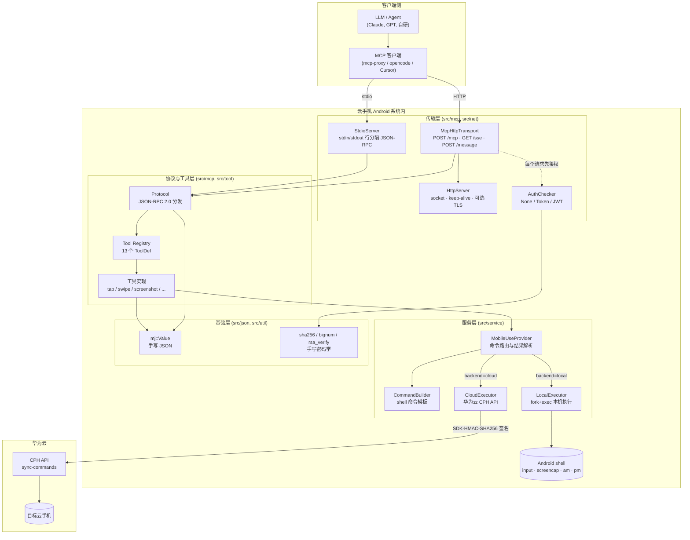
```mermaid
flowchart TB
    subgraph Clients["客户端侧"]
        LLM["LLM / Agent<br/>(Claude, GPT, 自研)"]
        MCPCLI["MCP 客户端<br/>(mcp-proxy / opencode / Cursor)"]
    end

    subgraph Device["云手机 Android 系统内"]
        subgraph Transports["传输层 (src/mcp, src/net)"]
            STDIO["StdioServer<br/>stdin/stdout 行分隔 JSON-RPC"]
            HTTP["McpHttpTransport<br/>POST /mcp · GET /sse · POST /message"]
            HTTPSRV["HttpServer<br/>socket · keep-alive · 可选 TLS"]
            AUTH["AuthChecker<br/>None / Token / JWT"]
        end

        subgraph Core["协议与工具层 (src/mcp, src/tool)"]
            PROTO["Protocol<br/>JSON-RPC 2.0 分发"]
            REG["Tool Registry<br/>13 个 ToolDef"]
            TOOLS["工具实现<br/>tap / swipe / screenshot / ..."]
        end

        subgraph Service["服务层 (src/service)"]
            PROV["MobileUseProvider<br/>命令路由与结果解析"]
            CB["CommandBuilder<br/>shell 命令模板"]
            LOCAL["LocalExecutor<br/>fork+exec 本机执行"]
            CLOUD["CloudExecutor<br/>华为云 CPH API"]
        end

        subgraph Util["基础层 (src/json, src/util)"]
            JSON["mj::Value<br/>手写 JSON"]
            CRYPTO["sha256 / bignum / rsa_verify<br/>手写密码学"]
        end

        SHELL[("Android shell<br/>input · screencap · am · pm")]
    end

    subgraph Cloud["华为云"]
        CPH["CPH API<br/>sync-commands"]
        PHONE[("目标云手机")]
    end

    LLM --> MCPCLI
    MCPCLI -->|stdio| STDIO
    MCPCLI -->|HTTP| HTTP
    HTTP --> HTTPSRV
    HTTP -.->|每个请求先鉴权| AUTH
    STDIO --> PROTO
    HTTP --> PROTO
    PROTO --> REG --> TOOLS
    TOOLS --> PROV
    PROV --> CB
    PROV -->|backend=local| LOCAL
    PROV -->|backend=cloud| CLOUD
    LOCAL --> SHELL
    CLOUD -->|SDK-HMAC-SHA256 签名| CPH
    CPH --> PHONE
    TOOLS --> JSON
    PROTO --> JSON
    AUTH --> CRYPTO
```

### 2.2 分层职责

| 层 | 目录 | 职责 | 关键约束 |
|---|---|---|---|
| 基础层 | `src/json` `src/util` | JSON DOM/解析/序列化、base64、SHA256/HMAC、大数运算、RSA 验签 | 零依赖，全平台可编译 |
| 网络层 | `src/net` | HTTP/1.1 服务端（keep-alive、路由）、HTTP(S) 客户端（URL 拉取） | POSIX socket，OpenSSL 可选 |
| 协议层 | `src/mcp` | JSON-RPC 2.0 分发、MCP 方法、鉴权、JWT 验签、三种传输 | 严格错误码语义 |
| 服务层 | `src/service` | shell 命令生成、本机/云端执行、结果解析 | 后端可插拔 |
| 工具层 | `src/tool` | 13 个 MCP 工具的 schema 与 handler | 声明式注册 |
| 入口层 | `src/main.cpp` `src/android` | CLI 解析、服务启动、JNI 桥接 | Android/主机双形态 |

**设计原则：单向依赖**——上层可依赖下层，下层不感知上层。`json/util` 不依赖任何
项目模块；`net` 只依赖 `util`；`mcp` 依赖 `net/json/tool`；`tool` 依赖 `service/json`。

---

## 3. 模块详细设计

### 3.1 JSON 模块（src/json）

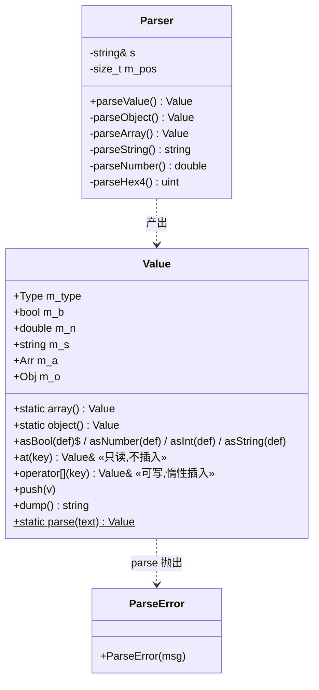
```mermaid
classDiagram
    class Value {
        +Type m_type
        +bool m_b
        +double m_n
        +string m_s
        +Arr m_a
        +Obj m_o
        +static array() Value
        +static object() Value
        +asBool(def)$ / asNumber(def) / asInt(def) / asString(def)
        +at(key) Value&  «只读,不插入»
        +operator[](key) Value&  «可写,惰性插入»
        +push(v)
        +dump() string
        +static parse(text)$ Value
    }
    class ParseError {
        +ParseError(msg)
    }
    class Parser {
        -string& s
        -size_t m_pos
        +parseValue() Value
        -parseObject() Value
        -parseArray() Value
        -parseString() string
        -parseNumber() double
        -parseHex4() uint
    }
    Value ..> ParseError : parse 抛出
    Parser ..> Value : 产出
```

**设计要点：**

1. **对象有序**：`Obj = vector<pair<string,Value>>`，保留键插入顺序。MCP 的
   `tools/list` 响应需要按注册顺序返回工具，故放弃无序 map。
2. **数字统一 double**：dump 时对整数值输出无小数点格式（`%lld`），避免
   `42.000000` 噪音。
3. **operator[] 双语义**：非 const 版本惰性插入（构造响应方便），const 场景
   必须用 `at()`（不插入、不修改）。
4. **完整 Unicode**：`\uXXXX` 解析支持代理对合并（`0x10000 + ((hi-0xD800)<<10)
   + (lo-0xDC00)`），保证 emoji 正确。

### 3.2 密码学工具（src/util）

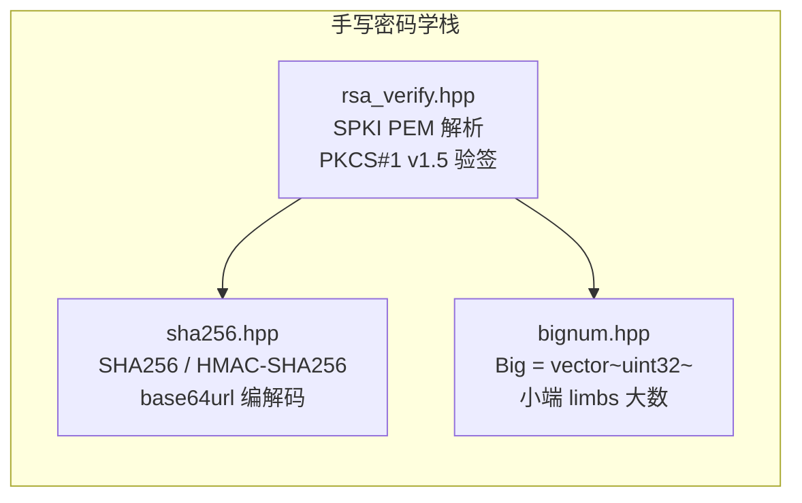
```mermaid
flowchart LR
    subgraph Crypto["手写密码学栈"]
        SHA["sha256.hpp<br/>SHA256 / HMAC-SHA256<br/>base64url 编解码"]
        BIG["bignum.hpp<br/>Big = vector~uint32~<br/>小端 limbs 大数"]
        RSA["rsa_verify.hpp<br/>SPKI PEM 解析<br/>PKCS#1 v1.5 验签"]
    end
    RSA --> BIG
    RSA --> SHA
```

| 组件 | 算法 | 用途 |
|---|---|---|
| `sha256` | SHA-256、HMAC-SHA256（RFC 2104）、base64/base64url | JWT HS256、华为云签名 |
| `bignum` | 任意精度无符号整数（加/减/乘/模/模幂），2^32 进制小端 limbs | RSA 模幂运算 |
| `rsa_verify` | SPKI DER TLV 解析 + RSA PKCS#1 v1.5 SHA256 验签 | JWT RS256（无 OpenSSL 时） |

**rsa_verify 关键实现约束（踩坑记录）：**

- `parseSpkiPem`：PEM → base64 解码 → DER TLV 逐层解析。读完 AlgorithmIdentifier
  后**必须跳转** `p = algId.dataOff + algId.len`，否则会误把算法 OID 当公钥解析。
- `bigFromBytes`：字节流转 limbs 必须按 chunk 处理；对 `len` 非 4 倍数做
  `i -= 4` 会发生无符号下溢死循环（历史 bug）。
- 验签比较 EM（`00 01 FF..FF 00 DigestInfo`）必须**常数时间**，防计时侧信道。

### 3.3 网络层（src/net）

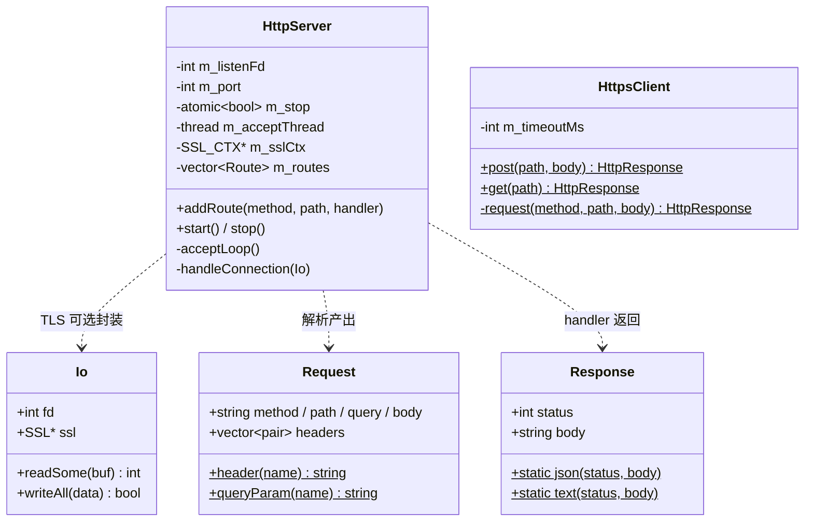
```mermaid
classDiagram
    class HttpServer {
        -int m_listenFd
        -int m_port
        -atomic~bool~ m_stop
        -thread m_acceptThread
        -SSL_CTX* m_sslCtx
        -vector~Route~ m_routes
        +addRoute(method, path, handler)
        +start() / stop()
        -acceptLoop()
        -handleConnection(Io)
    }
    class Io {
        +int fd
        +SSL* ssl
        +readSome(buf) int
        +writeAll(data) bool
    }
    class Request {
        +string method / path / query / body
        +vector~pair~ headers
        +header(name)$ string
        +queryParam(name)$ string
    }
    class Response {
        +int status
        +string body
        +static json(status, body)$
        +static text(status, body)$
    }
    class HttpsClient {
        -int m_timeoutMs
        +post(path, body)$ HttpResponse
        +get(path)$ HttpResponse
        -request(method, path, body)$ HttpResponse
    }
    HttpServer ..> Io : TLS 可选封装
    HttpServer ..> Request : 解析产出
    HttpServer ..> Response : handler 返回
```

**设计要点：**

- **Io 抽象**：socket 读写封装为 `Io` 结构，编译宏 `MCP_WITH_OPENSSL` 开启时
  `ssl` 字段非空、读写走 `SSL_read/SSL_write`，否则走 `recv/send`——上层
  （http_transport）完全不感知 TLS。
- **keep-alive**：单连接最多 100 个请求、60 秒空闲 `SO_RCVTIMEO` 超时，
  兼容 `Connection: close` 显式关闭。
- **fetchUrl**：`https://` 走 OpenSSL（无 OpenSSL 编译时返回错误），`http://`
  走明文 socket——供 JWKS 公钥拉取使用。

### 3.4 协议层（src/mcp）

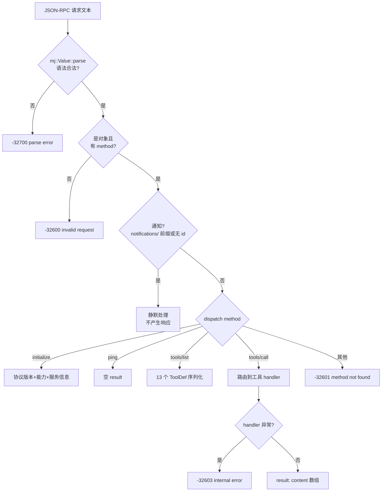
```mermaid
flowchart TD
    REQ["JSON-RPC 请求文本"] --> PARSE{"mj::Value::parse<br/>语法合法?"}
    PARSE -->|否| E1["-32700 parse error"]
    PARSE -->|是| OBJ{"是对象且<br/>有 method?"}
    OBJ -->|否| E2["-32600 invalid request"]
    OBJ -->|是| NOTIF{"通知?<br/>notifications/ 前缀或无 id"}
    NOTIF -->|是| DROP["静默处理<br/>不产生响应"]
    NOTIF -->|否| DISP{"dispatch method"}
    DISP -->|initialize| INIT["协议版本+能力+服务信息"]
    DISP -->|ping| PING["空 result"]
    DISP -->|tools/list| TL["13 个 ToolDef 序列化"]
    DISP -->|tools/call| TC["路由到工具 handler"]
    DISP -->|其他| E3["-32601 method not found"]
    TC --> EX{"handler 异常?"}
    EX -->|是| E4["-32603 internal error"]
    EX -->|否| RES["result: content 数组"]
```

**错误码语义（严格遵循 JSON-RPC 2.0）：**

| 码 | 含义 | 触发条件 |
|---|---|---|
| -32700 | parse error | 请求文本不是合法 JSON |
| -32600 | invalid request | 非对象 / 缺 method 字段 |
| -32601 | method not found | 未注册的 method |
| -32603 | internal error | handler 抛异常（兜底捕获） |
| 业务错误 | `result.isError=true` | 工具执行失败（不占用协议错误码） |

**关键约定**：工具执行失败**不**返回 JSON-RPC 错误，而是返回
`{result: {isError: true, content: [...]}}`——LLM 可以读到失败原因并自我纠正，
协议层保持畅通。

### 3.5 服务层（src/service）

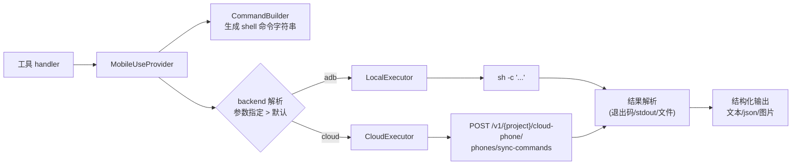
```mermaid
flowchart LR
    TOOL["工具 handler"] --> PROV["MobileUseProvider"]
    PROV --> CB["CommandBuilder<br/>生成 shell 命令字符串"]
    PROV --> RES{"backend 解析<br/>参数指定 > 默认"}
    RES -->|adb| LE["LocalExecutor"]
    RES -->|cloud| CE["CloudExecutor"]
    LE --> SH["sh -c '...'"]
    CE --> API["POST /v1/{project}/cloud-phone/<br/>phones/sync-commands"]
    SH --> PARSE["结果解析<br/>(退出码/stdout/文件)"]
    API --> PARSE
    PARSE --> OUT["结构化输出<br/>文本/json/图片"]
```

- **CommandBuilder**：纯函数集合，把工具参数转成 Android shell 命令
  （`input tap x y`、`screencap -p`、`am start -n`、`pm list packages` 等），
  所有用户输入经 `shellQuote` 转义。
- **MobileUseProvider**：持有 LocalExecutor/CloudExecutor 双实例，按调用参数
  `backend`（或默认后端）路由；负责把 ExecResult 解析为领域对象
  （AppItem 列表、Screenshot 字节等）。

---

## 4. 线程模型

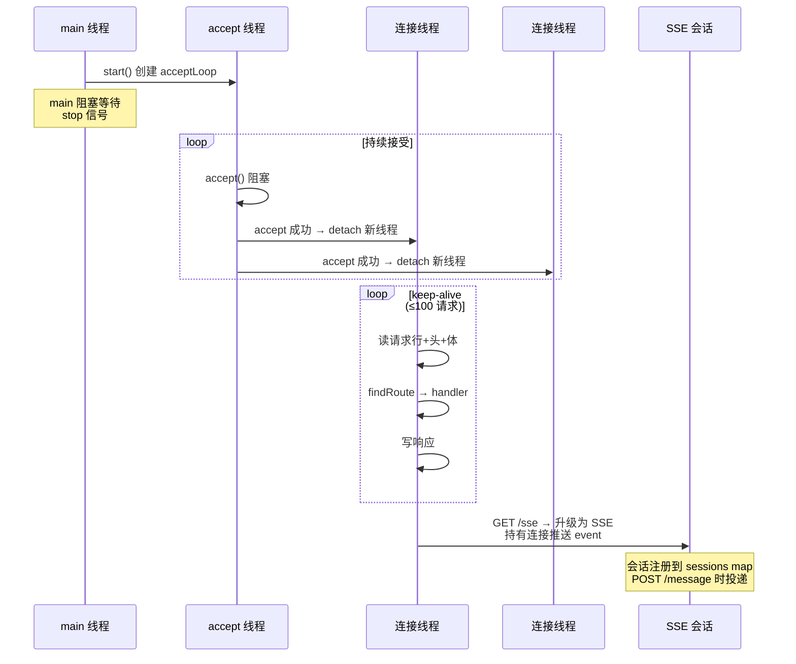
```mermaid
sequenceDiagram
    participant M as main 线程
    participant A as accept 线程
    participant C1 as 连接线程 #1
    participant C2 as 连接线程 #2
    participant S as SSE 会话

    M->>A: start() 创建 acceptLoop
    Note over M: main 阻塞等待<br/>stop 信号
    loop 持续接受
        A->>A: accept() 阻塞
        A->>C1: accept 成功 → detach 新线程
        A->>C2: accept 成功 → detach 新线程
    end
    loop keep-alive (≤100 请求)
        C1->>C1: 读请求行+头+体
        C1->>C1: findRoute → handler
        C1->>C1: 写响应
    end
    C1->>S: GET /sse → 升级为 SSE<br/>持有连接推送 event
    Note over S: 会话注册到 sessions map<br/>POST /message 时投递
```

**设计要点：**

1. **thread-per-connection**：云手机场景并发低（单 LLM 会话为主），
   拒绝引入 epoll 事件循环的复杂度；每连接一个 detached 线程。
2. **线程安全边界**：
   - `AuthChecker` 值语义 const 方法，无锁；
   - SSE sessions map 由 `m_sessionsMutex` 保护；
   - `mj::Value` 无共享状态，每请求独立构造；
   - `LocalExecutor` 每次调用独立 fork，无共享。
3. **优雅退出**：`stop()` 置 `m_stop` 并 `shutdown(m_listenFd)` 使 accept 退出；
   连接线程靠 60 秒读超时自然回收。

---

## 5. 传输层设计

### 5.1 stdio 传输

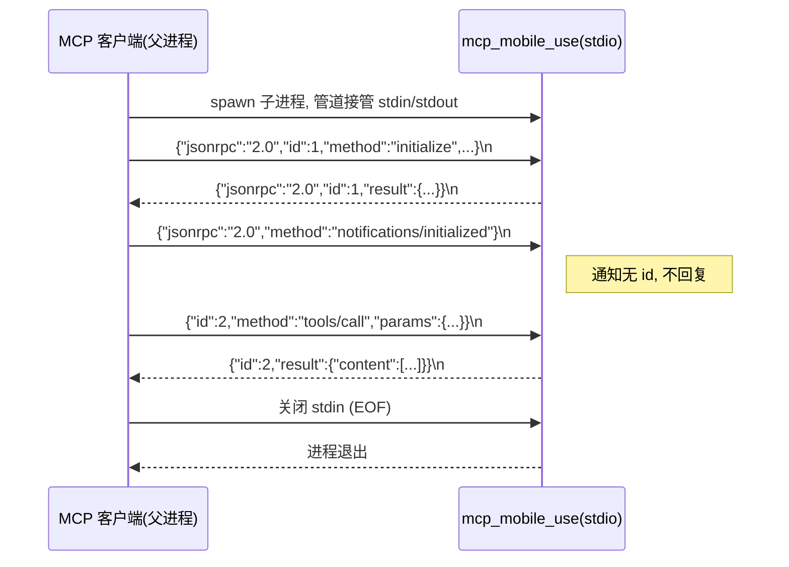
```mermaid
sequenceDiagram
    participant CLI as MCP 客户端(父进程)
    participant SRV as mcp_mobile_use(stdio)

    CLI->>SRV: spawn 子进程, 管道接管 stdin/stdout
    CLI->>SRV: {"jsonrpc":"2.0","id":1,"method":"initialize",...}\n
    SRV-->>CLI: {"jsonrpc":"2.0","id":1,"result":{...}}\n
    CLI->>SRV: {"jsonrpc":"2.0","method":"notifications/initialized"}\n
    Note right of SRV: 通知无 id, 不回复
    CLI->>SRV: {"id":2,"method":"tools/call","params":{...}}\n
    SRV-->>CLI: {"id":2,"result":{"content":[...]}}\n
    CLI->>SRV: 关闭 stdin (EOF)
    SRV-->>CLI: 进程退出
```

**帧格式**：每行一个完整 JSON 文档（`\n` 分隔），日志只写 stderr，
stdout 专用于协议帧。

### 5.2 Streamable HTTP 传输（POST /mcp）

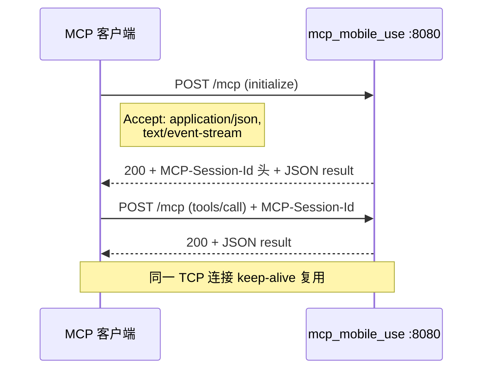
```mermaid
sequenceDiagram
    participant CLI as MCP 客户端
    participant SRV as mcp_mobile_use :8080

    CLI->>SRV: POST /mcp (initialize)
    Note right of CLI: Accept: application/json,<br/>text/event-stream
    SRV-->>CLI: 200 + MCP-Session-Id 头 + JSON result
    CLI->>SRV: POST /mcp (tools/call) + MCP-Session-Id
    SRV-->>CLI: 200 + JSON result
    Note over CLI,SRV: 同一 TCP 连接 keep-alive 复用
```

### 5.3 SSE 传输（GET /sse + POST /message）

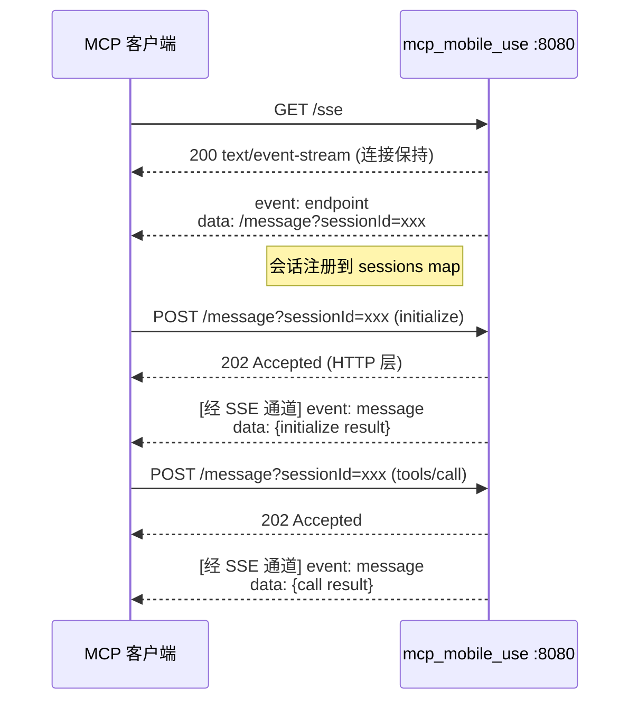
```mermaid
sequenceDiagram
    participant CLI as MCP 客户端
    participant SRV as mcp_mobile_use :8080

    CLI->>SRV: GET /sse
    SRV-->>CLI: 200 text/event-stream (连接保持)
    SRV-->>CLI: event: endpoint<br/>data: /message?sessionId=xxx
    Note left of SRV: 会话注册到 sessions map
    CLI->>SRV: POST /message?sessionId=xxx (initialize)
    SRV-->>CLI: 202 Accepted (HTTP 层)
    SRV-->>CLI: [经 SSE 通道] event: message<br/>data: {initialize result}
    CLI->>SRV: POST /message?sessionId=xxx (tools/call)
    SRV-->>CLI: 202 Accepted
    SRV-->>CLI: [经 SSE 通道] event: message<br/>data: {call result}
```

**要点**：SSE 是"响应走推送通道"的双工模式——POST /message 只确认接收（202），
真正的 JSON-RPC 响应从 SSE 长连接以 `event: message` 推回。

### 5.4 端点总表与鉴权位置

| 端点 | 方法 | 用途 | 鉴权 |
|---|---|---|---|
| `/healthz` | GET | 存活探针，返回 `ok` | **豁免** |
| `/mcp` | POST | Streamable HTTP 主端点 | 每个请求 |
| `/sse` | GET | SSE 连接建立 | 建立时 |
| `/message` | POST | SSE 会话消息投递 | 每个请求 |

---

## 6. 鉴权体系设计

### 6.1 鉴权决策流程

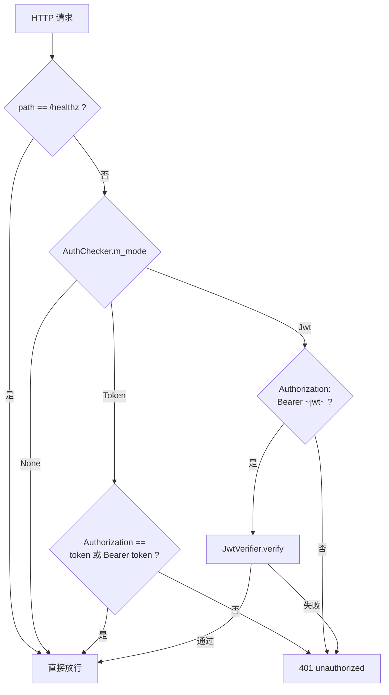
```mermaid
flowchart TD
    REQ["HTTP 请求"] --> HEALTH{"path == /healthz ?"}
    HEALTH -->|是| PASS["直接放行"]
    HEALTH -->|否| MODE{"AuthChecker.m_mode"}
    MODE -->|None| PASS
    MODE -->|Token| TOK{"Authorization ==<br/>token 或 Bearer token ?"}
    TOK -->|是| PASS
    TOK -->|否| REJ["401 unauthorized"]
    MODE -->|Jwt| JWT{"Authorization:<br/>Bearer ~jwt~ ?"}
    JWT -->|否| REJ
    JWT -->|是| VERIFY["JwtVerifier.verify"]
    VERIFY -->|通过| PASS
    VERIFY -->|失败| REJ
```

### 6.2 JWT 验签流程（双算法、双引擎）

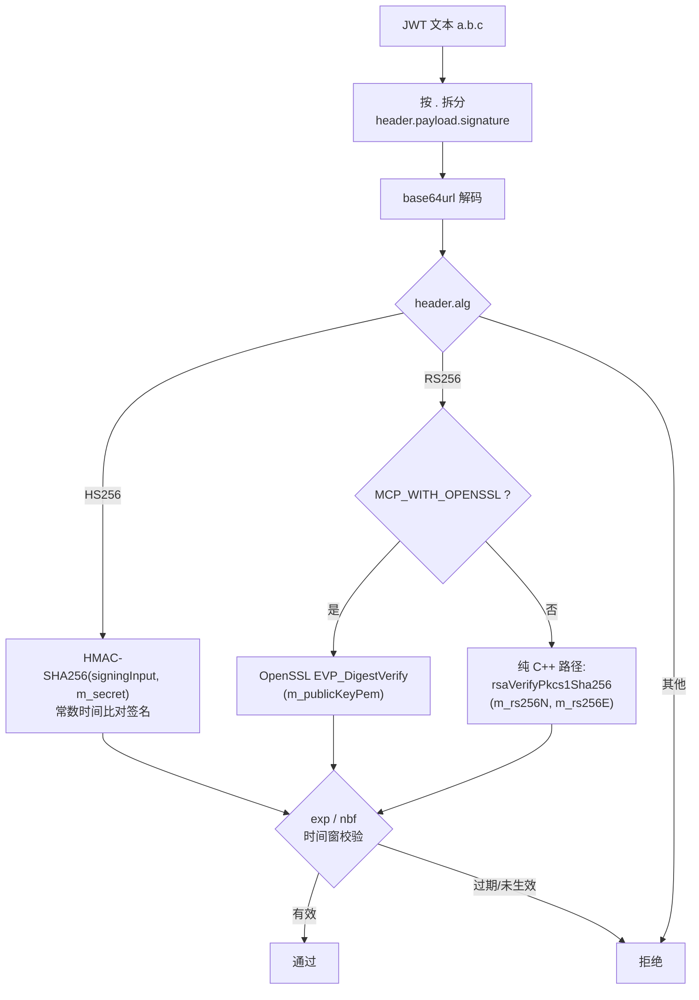
```mermaid
flowchart TD
    TOK["JWT 文本 a.b.c"] --> SPLIT["按 . 拆分<br/>header.payload.signature"]
    SPLIT --> B64["base64url 解码"]
    B64 --> ALG{"header.alg"}
    ALG -->|HS256| HS["HMAC-SHA256(signingInput, m_secret)<br/>常数时间比对签名"]
    ALG -->|RS256| ENGINE{"MCP_WITH_OPENSSL ?"}
    ENGINE -->|是| EVP["OpenSSL EVP_DigestVerify<br/>(m_publicKeyPem)"]
    ENGINE -->|否| PURE["纯 C++ 路径:<br/>rsaVerifyPkcs1Sha256<br/>(m_rs256N, m_rs256E)"]
    ALG -->|其他| REJ["拒绝"]
    HS --> TIME{"exp / nbf<br/>时间窗校验"}
    EVP --> TIME
    PURE --> TIME
    TIME -->|有效| OK["通过"]
    TIME -->|过期/未生效| REJ
```

### 6.3 RS256 公钥三种来源与 JWKS URL 拉取

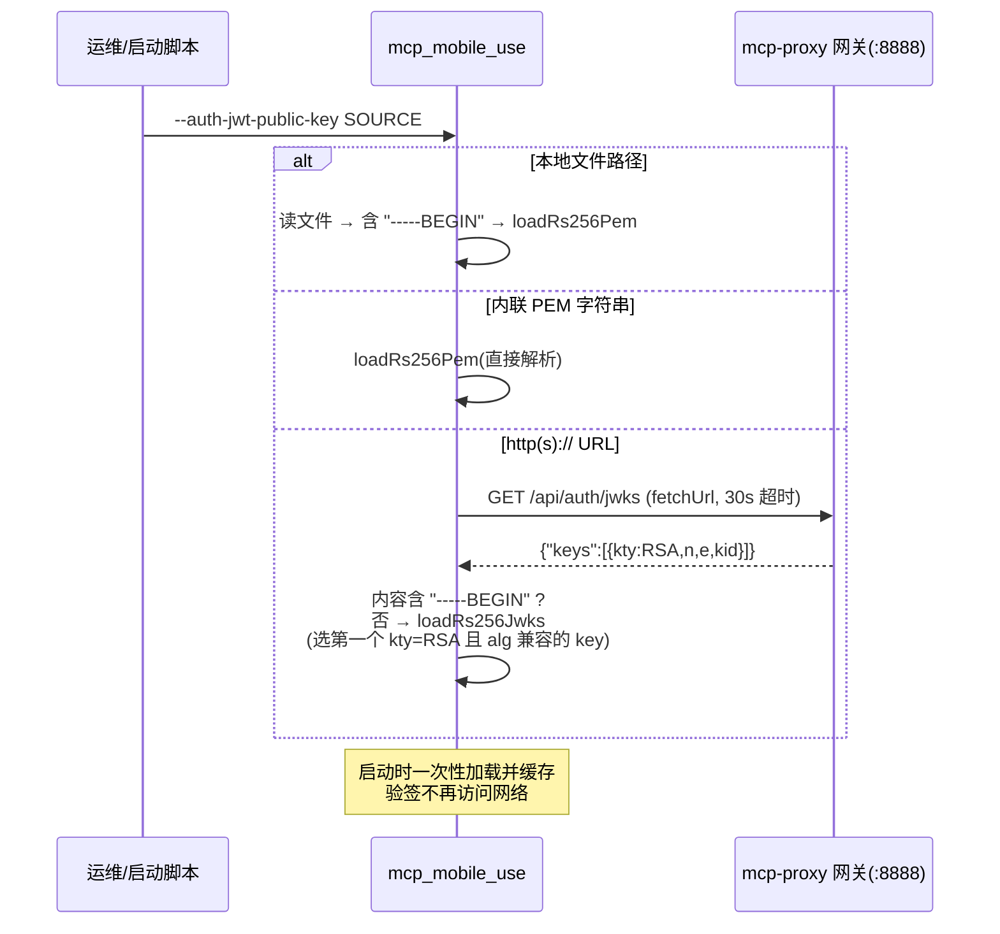
```mermaid
sequenceDiagram
    participant OP as 运维/启动脚本
    participant SRV as mcp_mobile_use
    participant GW as mcp-proxy 网关(:8888)

    OP->>SRV: --auth-jwt-public-key SOURCE
    alt 本地文件路径
        SRV->>SRV: 读文件 → 含 "-----BEGIN" → loadRs256Pem
    else 内联 PEM 字符串
        SRV->>SRV: loadRs256Pem(直接解析)
    else http(s):// URL
        SRV->>GW: GET /api/auth/jwks (fetchUrl, 30s 超时)
        GW-->>SRV: {"keys":[{kty:RSA,n,e,kid}]}
        SRV->>SRV: 内容含 "-----BEGIN" ?<br/>否 → loadRs256Jwks<br/>(选第一个 kty=RSA 且 alg 兼容的 key)
    end
    Note over SRV: 启动时一次性加载并缓存<br/>验签不再访问网络
```

**与 mcp-proxy 网关的集成关系：**

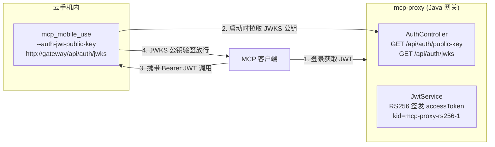
```mermaid
flowchart LR
    subgraph Proxy["mcp-proxy (Java 网关)"]
        AC["AuthController<br/>GET /api/auth/public-key<br/>GET /api/auth/jwks"]
        JS["JwtService<br/>RS256 签发 accessToken<br/>kid=mcp-proxy-rs256-1"]
    end
    subgraph Phone["云手机内"]
        MCP["mcp_mobile_use<br/>--auth-jwt-public-key<br/>http://gateway/api/auth/jwks"]
    end
    CLIENT["MCP 客户端"] -->|1. 登录获取 JWT| Proxy
    MCP -->|2. 启动时拉取 JWKS 公钥| AC
    CLIENT -->|3. 携带 Bearer JWT 调用| MCP
    MCP -->|4. JWKS 公钥验签放行| CLIENT
```

**信任模型**：私钥只存在于 mcp-proxy；云手机内只部署公钥（JWKS），
即使设备被完全控制也无法伪造 JWT。

---

## 7. 执行后端设计

### 7.1 LocalExecutor 进程模型

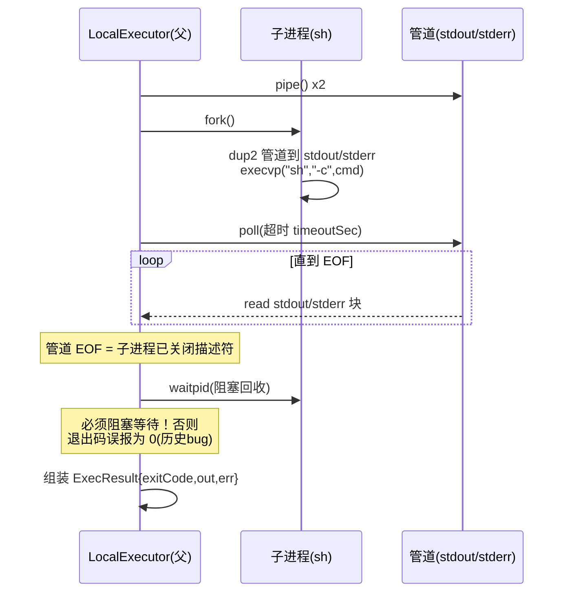
```mermaid
sequenceDiagram
    participant P as LocalExecutor(父)
    participant K as 子进程(sh)
    participant PIPE as 管道(stdout/stderr)

    P->>PIPE: pipe() x2
    P->>K: fork()
    K->>K: dup2 管道到 stdout/stderr<br/>execvp("sh","-c",cmd)
    P->>PIPE: poll(超时 timeoutSec)
    loop 直到 EOF
        PIPE-->>P: read stdout/stderr 块
    end
    Note over P: 管道 EOF = 子进程已关闭描述符
    P->>K: waitpid(阻塞回收)
    Note over P: 必须阻塞等待！否则<br/>退出码误报为 0(历史bug)
    P->>P: 组装 ExecResult{exitCode,out,err}
```

### 7.2 CloudExecutor 调用流程

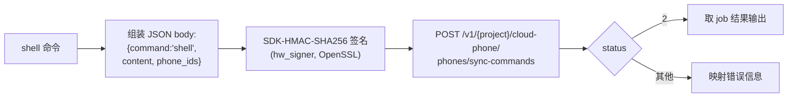
```mermaid
flowchart LR
    REQ["shell 命令"] --> BODY["组装 JSON body:<br/>{command:'shell',<br/>content, phone_ids}"]
    BODY --> SIGN["SDK-HMAC-SHA256 签名<br/>(hw_signer, OpenSSL)"]
    SIGN --> POST["POST /v1/{project}/cloud-phone/<br/>phones/sync-commands"]
    POST --> RESP{"status"}
    RESP -->|2| OK["取 job 结果输出"]
    RESP -->|其他| ERR["映射错误信息"]
```

**backend 参数语义**：每个工具调用的 `backend` 参数（`adb`/`cloud`，见 API 文档）
可覆盖默认后端，实现"同一服务同时操控本机与远端云手机"。

---

## 8. 工具调用端到端流程

以 `tap`（点击坐标）为例的完整调用链：

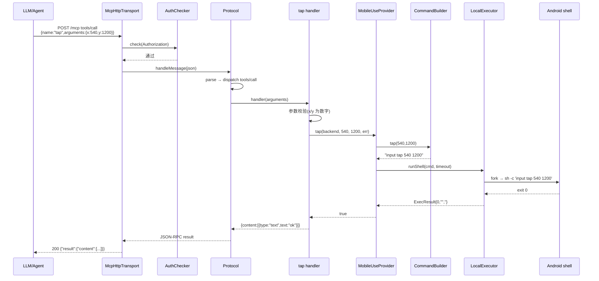
```mermaid
sequenceDiagram
    participant LLM as LLM/Agent
    participant HTTP as McpHttpTransport
    participant AUTH as AuthChecker
    participant PROTO as Protocol
    participant TOOL as tap handler
    participant PROV as MobileUseProvider
    participant CB as CommandBuilder
    participant EX as LocalExecutor
    participant OS as Android shell

    LLM->>HTTP: POST /mcp tools/call<br/>{name:"tap",arguments:{x:540,y:1200}}
    HTTP->>AUTH: check(Authorization)
    AUTH-->>HTTP: 通过
    HTTP->>PROTO: handleMessage(json)
    PROTO->>PROTO: parse → dispatch tools/call
    PROTO->>TOOL: handler(arguments)
    TOOL->>TOOL: 参数校验(x/y 为数字)
    TOOL->>PROV: tap(backend, 540, 1200, err)
    PROV->>CB: tap(540,1200)
    CB-->>PROV: "input tap 540 1200"
    PROV->>EX: runShell(cmd, timeout)
    EX->>OS: fork → sh -c 'input tap 540 1200'
    OS-->>EX: exit 0
    EX-->>PROV: ExecResult{0,"","}
    PROV-->>TOOL: true
    TOOL-->>PROTO: {content:[{type:"text",text:"ok"}]}
    PROTO-->>HTTP: JSON-RPC result
    HTTP-->>LLM: 200 {"result":{"content":[...]}}
```

**截图数据流（二进制内容的处理）：**

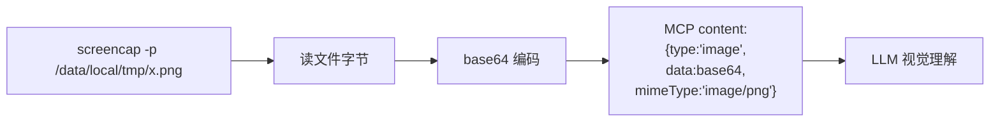
```mermaid
flowchart LR
    SC["screencap -p /data/local/tmp/x.png"] --> READ["读文件字节"]
    READ --> B64["base64 编码"]
    B64 --> CNT["MCP content:<br/>{type:'image',<br/>data:base64,<br/>mimeType:'image/png'}"]
    CNT --> LLM["LLM 视觉理解"]
```

---

## 9. JNI 与 Android APK 架构

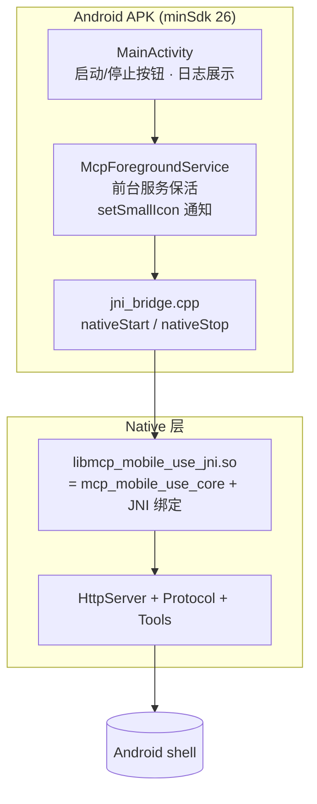
```mermaid
flowchart TB
    subgraph APK["Android APK (minSdk 26)"]
        ACT["MainActivity<br/>启动/停止按钮 · 日志展示"]
        FGS["McpForegroundService<br/>前台服务保活<br/>setSmallIcon 通知"]
        JNI["jni_bridge.cpp<br/>nativeStart / nativeStop"]
    end
    subgraph Native["Native 层"]
        CORE["libmcp_mobile_use_jni.so<br/>= mcp_mobile_use_core + JNI 绑定"]
        SRV["HttpServer + Protocol + Tools"]
    end
    ACT --> FGS
    FGS --> JNI
    JNI --> CORE --> SRV
    SRV --> SHELL[("Android shell")]
```

**要点：**

- APK 只是壳：点击启动后，前台服务调用 `nativeStart(port)` 在 JNI 线程中
  运行整个 MCP 服务端；`nativeStop()` 置停止标志。
- 前台服务必须 `setSmallIcon`，否则 Android 12+ 抛
  `Bad notification for startForeground`（历史修复）。
- minSdk 26：对齐 `fork/exec`、`poll`、TLS 等 POSIX 能力基线。

---

## 10. 构建系统

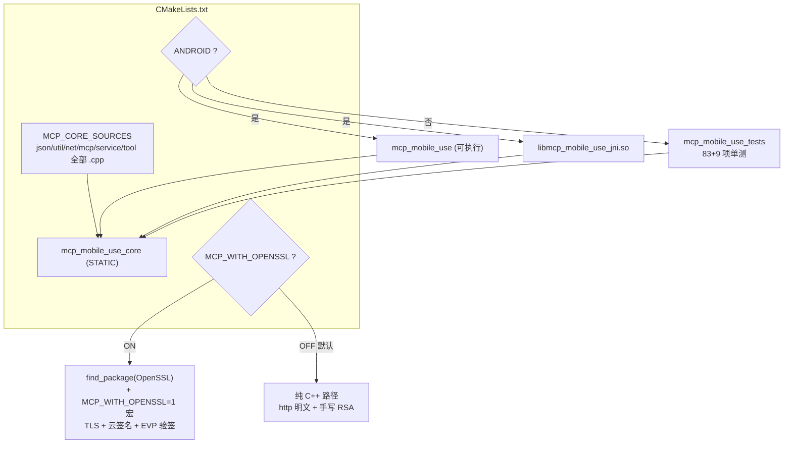
```mermaid
flowchart TD
    subgraph CMake["CMakeLists.txt"]
        SRCS["MCP_CORE_SOURCES<br/>json/util/net/mcp/service/tool 全部 .cpp"]
        CORE["mcp_mobile_use_core (STATIC)"]
        OPT{"MCP_WITH_OPENSSL ?"}
        PLAT{"ANDROID ?"}
    end
    SRCS --> CORE
    OPT -->|ON| OSSL["find_package(OpenSSL)<br/>+ MCP_WITH_OPENSSL=1 宏<br/>TLS + 云签名 + EVP 验签"]
    OPT -->|OFF 默认| NOSSL["纯 C++ 路径<br/>http 明文 + 手写 RSA"]
    PLAT -->|是| EXE["mcp_mobile_use (可执行)"]
    PLAT -->|是| JNILIB["libmcp_mobile_use_jni.so"]
    PLAT -->|否| TESTS["mcp_mobile_use_tests<br/>83+9 项单测"]
    EXE & JNILIB & TESTS --> CORE
```

| 构建产物 | 工具链 | 命令 |
|---|---|---|
| Android arm64 可执行 + JNI 库 | NDK 26 + clang | `cmake -B build-android -DCMAKE_TOOLCHAIN_FILE=.../android.toolchain.cmake -DANDROID_ABI=arm64-v8a -DANDROID_PLATFORM=android-26 && cmake --build build-android` |
| 主机单测 | MinGW g++ 15 | `cmake -B build-host -G "MinGW Makefiles" && cmake --build build-host --target mcp_mobile_use_tests` |
| APK | gradle 8.7 | `scripts/build_apk.bat` |

---

## 11. 部署架构

```mermaid
flowchart TB
    subgraph Dev["开发调试拓扑"]
        HOST["开发机<br/>adb forward tcp:8080"]
        DEV1["实体机/云手机<br/>/data/local/tmp/mcp_mobile_use"]
        HOST <-->|adb forward| DEV1
    end
    subgraph Prod["生产拓扑"]
        GW["mcp-proxy 网关<br/>JWT 签发 + JWKS 公钥端点"]
        subgraph CP["云手机实例"]
            APP["mcp_mobile_use (APK/二进制)<br/>auth: jwt, 启动拉取 JWKS"]
        end
        AGENT["LLM Agent"] -->|Bearer JWT| APP
        APP -->|启动时 GET /api/auth/jwks| GW
        AGENT -->|1. 登录| GW
    end
```

**网络打通方式：**

| 场景 | 方式 |
|---|---|
| 开发机直连设备 | `adb forward tcp:8080 tcp:8080` |
| 设备访问开发机 mock 网关 | `adb reverse tcp:8888 tcp:8888` |
| 生产云手机 | 云手机内网直达网关地址（URL 配置） |

---

## 12. 源码目录结构

```
mcp_mobile_use/
├── CMakeLists.txt              # 构建：core 静态库 / Android exe+jni / 主机单测
├── src/
│   ├── json/                   # 手写 JSON（Value/parse/dump）
│   │   ├── json.hpp  json.cpp
│   ├── util/                   # 基础工具
│   │   ├── util.hpp/.cpp       # base64、shellQuote、trim 等
│   │   ├── sha256.hpp/.cpp     # SHA256/HMAC/base64url
│   │   ├── bignum.hpp/.cpp     # 任意精度大数（RSA 用）
│   │   └── rsa_verify.hpp/.cpp # SPKI 解析 + PKCS#1 v1.5 验签
│   ├── net/
│   │   ├── http_server.hpp/.cpp  # HTTP/1.1 服务端（keep-alive/TLS 可选）
│   │   └── https_client.hpp/.cpp # HTTP(S) 客户端、fetchUrl
│   ├── mcp/
│   │   ├── protocol.hpp/.cpp       # JSON-RPC 2.0 分发
│   │   ├── auth.hpp/.cpp           # AuthChecker（None/Token/Jwt）
│   │   ├── jwt.hpp/.cpp            # JwtVerifier（HS256/RS256 双引擎）
│   │   ├── stdio_server.hpp/.cpp   # stdio 传输
│   │   └── http_transport.hpp/.cpp # HTTP/SSE 传输与路由
│   ├── service/
│   │   ├── executor.hpp            # ExecResult/Executor 接口
│   │   ├── local_executor.cpp      # fork+pipe+poll+waitpid
│   │   ├── cloud_executor.cpp      # 华为云 sync-commands
│   │   ├── cloud_config.hpp/.cpp   # CPH_* 环境变量
│   │   ├── hw_signer.hpp/.cpp      # SDK-HMAC-SHA256 签名
│   │   ├── command_builder.hpp/.cpp# 13 工具的 shell 命令模板
│   │   └── provider.hpp/.cpp       # MobileUseProvider 路由与解析
│   ├── tool/
│   │   ├── base.hpp/.cpp           # ToolDef、makeSchema、参数辅助
│   │   ├── registry.cpp            # 工具注册中心
│   │   └── (13 个工具 .cpp)        # tap/swipe/screenshot/text_input/
│   │                               # key_event(back,home,menu)/launch_app/
│   │                               # close_app/list_apps/install_app/
│   │                               # adb_shell/terminate
│   ├── main.cpp                    # CLI 入口（-t/-p/-b/--auth-* 等）
│   └── android/jni_bridge.cpp      # JNI：nativeStart/nativeStop
├── android/                      # APK 工程（minSdk 26，前台服务）
├── scripts/
│   ├── e2e_adb.ps1               # 设备端到端（16 项断言）
│   ├── deploy.ps1  build_apk.bat  build_native.ps1 等
├── tests/                        # 主机单测（83+9 项）
│   ├── test_framework.hpp  test_main.cpp
│   ├── test_json/util/jwt/command_builder.cpp
│   └── test_url_fetch.cpp        # URL 公钥拉取 mock 测试
└── docs/                         # 本文档所在
```

---

## 13. 关键设计决策记录（ADR）

### ADR-1：为什么全手写、零第三方依赖？

云手机 Android 环境无法保证 vcpkg/apt 等包管理可用，交叉编译第三方库
（nlohmann/json、libcurl、OpenSSL）链路脆弱。手写 JSON/HTTP/SHA256/RSA
共约 4000 行，换来**单 toolchain 即可构建**的确定性。

### ADR-2：为什么 RS256 要纯 C++ 实现一遍？

生产环境 OpenSSL 源码下载/编译在网络受限环境失败过。纯 C++ RSA 验签
（bignum + SPKI 解析，约 500 行）使 **无 OpenSSL 构建也能用 JWKS 公钥验签**；
有 OpenSSL 时优先 EVP（更快的常数时间实现）。双引擎以 `m_rs256N/m_rs256E`
（字节）与 `m_publicKeyPem` 双轨存储。

### ADR-3：为什么 thread-per-connection 而非 epoll 事件循环？

云手机 MCP 的典型负载是单 Agent 串行调用 + 少量并发探活。事件循环引入的
状态机复杂度远超收益；thread-per-conn + keep-alive（100 请求/60s 超时）
在目标负载下足够且代码直观。

### ADR-4：为什么工具失败不走 JSON-RPC 错误码？

`isError: true` 是 MCP 约定的业务错误通道：LLM 需要读到失败文本
（如 "package not found"）来规划下一步，协议错误会让客户端直接断开流程。
协议错误码只保留给**协议层**问题（语法/方法不存在/内部异常）。

### ADR-5：为什么对象用 vector\<pair\> 保持键序？

`tools/list` 的返回顺序即工具注册顺序，LLM 对列表顺序敏感（上下文中的
稳定性影响 prompt 缓存与选择倾向）；有序对象也让测试断言稳定。

### ADR-6：为什么信任模型是"私钥只在网关"？

云手机属于半可信环境（多租户、可能被实例回收复用）。RS256 非对称验签使
设备端只需公钥：即使设备文件系统被读取，攻击者也无法签发新 JWT。
设备启动时从网关 JWKS 端点拉公钥，公私钥轮换无需改设备配置。

### ADR-7：为什么 minSdk 26？

`fork/execvp/poll/waitpid` 全套 POSIX 进程能力 + TLS 1.2 系统支持在
API 26 形成稳定基线；同时覆盖市面几乎全部云手机镜像（Android 8.0+）。

---

> 相关文档：[API 设计](api.md) · [传输协议](transport.md) · [安全](security.md) ·
> [部署](deployment.md) · [测试](testing.md)
